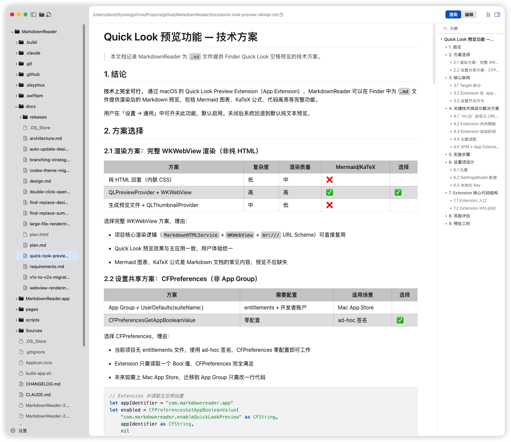

[简体中文](README.md) | **[繁體中文](README.zh-TW.md)** | [English](README.en.md) | [日本語](README.ja.md)

# Markdown Reader

> 不是又一個全能編輯器，只是一個安靜的閱讀器。

---

## 為什麼選它？

市面上 Markdown 工具越來越多，功能一個比一個全——即時協作、雲端同步、插件生態……但很多時候，你只是想**快速打開一個 .md 檔案，安安靜靜地讀完它**。

Markdown Reader 就是為這個場景而生：

- **沒有心理負擔** — 不註冊、不登入、沒有複雜設定，打開即用
- **秒開秒讀** — 原生 macOS 應用程式，啟動快、切換快、閱讀流暢
- **專注閱讀** — 三欄佈局，目錄樹 + 渲染檢視 + 大綱導航，一眼看清文件結構
- **極小極輕** — DMG 安裝包不到 10MB，不佔空間

當你不需要寫作、不需要協作、不需要花俏功能，只想**快速檢視 Markdown 文件**時，它就是最合適的選擇。

---

## 功能

| 功能 | 說明 |
|------|------|
| WKWebView 渲染引擎 | cmark-gfm + WKWebView 渲染，完整 GFM 擴展語法 |
| Mermaid 圖表 | 流程圖、時序圖、甘特圖等 Mermaid 圖表本機渲染 |
| PlantUML 圖表 | 支援 PlantUML 語法，自動渲染為 SVG 圖表（需要網路） |
| 數學公式 | KaTeX 渲染 LaTeX 行內和區塊公式 |
| Prism.js 程式碼高亮 | 30+ 語言語法高亮，Prism.js 引擎 |
| Quick Look 預覽 | Finder 中選取 .md 檔案按空白鍵即可預覽渲染效果，無需開啟應用程式 |
| 即時編輯 | 原文模式直接編輯，Cmd+S 儲存，切換檔案自動保留未儲存內容 |
| 目錄樹 | 遞迴瀏覽資料夾，鍵盤導航，右鍵新增/重新命名/刪除 |
| 大綱導航 | 自動提取標題層級，點擊跳轉，閱讀長文件更高效 |
| 33 套主題 | 20 深色 + 13 淺色，含 Markdown Preview Enhanced 風格主題，支援自訂配色和對比度調節 |
| 多語言 | 簡體中文、繁體中文、英文，自動跟隨系統 |
| 命令列工具 | `mdr` 命令從終端機直接開啟 Markdown 檔案 |
| 命令面板 | `Cmd+P` 快速搜尋並開啟目錄樹中的檔案 |
| 視窗恢復 | 記住上次瀏覽位置，重新開啟自動還原 |

---

## 快速鍵

| 快速鍵 | 功能 |
|--------|------|
| `Cmd+O` | 開啟目錄 / 檔案 |
| `Cmd+N` | 新增檔案 |
| `Cmd+S` | 儲存檔案 |
| `Cmd+Option+E` | 匯出 PDF |
| `Cmd+,` | 開啟設定 |
| `Cmd+\` | 切換側邊欄 |
| `Cmd+Shift+E` | 渲染模式 |
| `Cmd+Shift+R` | 原文模式 |
| `Cmd++` | 放大 |
| `Cmd+-` | 縮小 |
| `Cmd+0` | 實際大小 |
| `Cmd+F` | 尋找 |
| `Cmd+G` | 尋找下一個 |
| `Cmd+Shift+G` | 尋找上一個 |
| `Cmd+Option+F` | 尋找與取代 |
| `Cmd+P` | 命令面板 |

---

## 安裝

### 下載安裝

前往 [Releases](https://github.com/davidhoo/MarkdownReader/releases) 下載最新版 DMG，拖入應用程式資料夾即可。

### 系統需求

macOS 26 (Tahoe) 或更高版本。

---

## 官方網站

[https://davidhoo.github.io/MarkdownReader/](https://davidhoo.github.io/MarkdownReader/)

---

## 致謝

Markdown Reader 的建構離不開以下開源專案：

- [cmark-gfm](https://github.com/github/cmark-gfm) — GitHub Flavored Markdown 解析與渲染引擎
- [swift-markdown](https://github.com/apple/swift-markdown) — Apple 的 Swift Markdown 解析庫（基於 cmark-gfm）
- [KaTeX](https://katex.org/) — 高速 LaTeX 數學公式渲染
- [Mermaid](https://mermaid.js.org/) — 基於文字的圖表生成（流程圖、時序圖、甘特圖等）
- [Prism.js](https://prismjs.com/) — 輕量級程式碼語法高亮
- [PlantUML](https://plantuml.com/) — 開源 UML 圖表渲染

特別感謝 [linux.do](https://linux.do/) 社羣的回饋與支援。

---

MIT License
