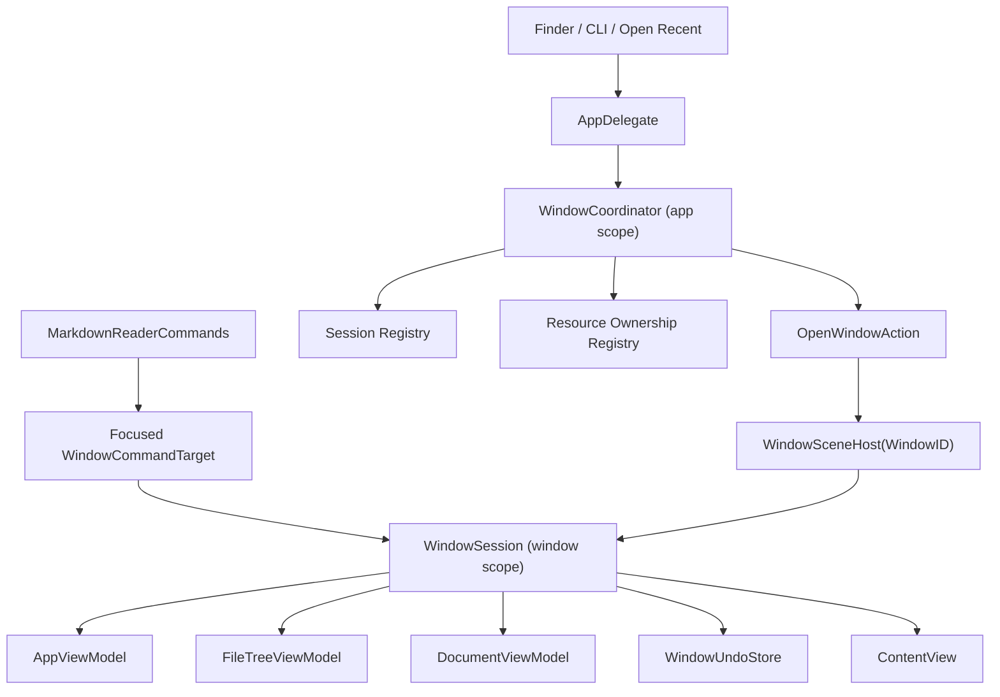

# MarkdownReader 多窗口技术设计

> 状态：已确认方案，待实施
>
> 日期：2026-07-14
>
> 对应需求：[`docs/multi-window-requirements.md`](../multi-window-requirements.md)
>
> 产品模型：Word 式文档多窗口

## 1. 设计目标

本设计将 MarkdownReader 从“SwiftUI 允许创建多个 `ContentView`，但业务仍按单窗口运行”改造成真正的多窗口应用。

核心目标：

1. 每个主窗口拥有稳定的 `WindowID` 和独立的 `WindowSession`。
2. 所有资源打开入口统一交给应用级 `WindowCoordinator` 路由。
3. 菜单命令通过 SwiftUI `FocusedValues` 路由到活动窗口，不再广播给所有窗口。
4. 同一文件只由一个窗口会话持有；重复打开时激活已有窗口。
5. Undo、文件监控、保存面板、拖拽反馈和视图状态按窗口隔离。
6. 冷启动、热启动、无可见窗口、Finder 多文件打开使用同一套确定性状态机，不依赖固定延时。
7. 首期禁用 SwiftUI 的多窗口自动恢复，只手动恢复最后活动位置到一个窗口。

## 2. 已确认的关键交互

当窗口 A 以单文件模式打开 `A.md`，窗口 B 打开 `A.md` 所在目录，用户在窗口 B 的目录树点击 `A.md` 时：

1. 窗口 B 在修改 `selectedFileURL` 前请求 `WindowCoordinator` 路由。
2. Coordinator 发现 `A.md` 已归窗口 A 所有。
3. 窗口 B 保持当前文档和当前有效选中项不变。
4. 恢复并前置窗口 A。
5. 窗口 A 保留原内容、脏状态、文件监控和 undo 历史。
6. `A.md` 在窗口 B 的文件行显示“已在另一窗口打开”标识。
7. 窗口 A 关闭并释放所有权后，窗口 B 再次点击 `A.md` 才在本窗口打开。

首期不提供“仍然打开副本”“只读副本”或“转移所有权”。

## 3. 当前实现问题

当前代码已有窗口级 ViewModel 实例，但外围链路包含以下单窗口假设：

| 位置 | 当前行为 | 多窗口风险 |
|------|----------|------------|
| `MarkdownReaderApp.swift` | 菜单通过全局 `NotificationCenter` 发命令 | 所有窗口同时响应 |
| `AppDelegate.swift` | `enforceSingleWindow()` 关闭多余主窗口 | 合法窗口被关闭 |
| `AppDelegate.swift` | 激活“第一个隐藏窗口” | 资源可能显示在错误窗口 |
| `AppDelegate.swift` | `application(_:open:)` 只处理首个 URL | Finder/CLI 多文件丢失 |
| `ContentView.swift` | 打开、保存等由视图通知监听器处理 | 路由依赖视图生命周期 |
| `DetailView.swift` | reload/export/drag 通知无目标窗口 | 多窗口重复执行或重复提示 |
| `WebViewMarkdownView.swift` | zoom 和链接打开使用全局通知 | 其他窗口被修改 |
| `OpenPanelHelper.swift` | 应用级 `isPanelShowing` + `runModal()` | 一个窗口的面板阻塞全部窗口 |
| `SyntaxHighlightedEditor.swift` | 全局 active undo manager | Cmd+Z 可能命中错误窗口 |
| `TrafficLightButtons.swift` | 操作 `NSApp.keyWindow` | 点击时 key window 变化会操作错误窗口 |
| `SettingsModel.swift` | last opened 由任意窗口写入 | 最后活动位置不确定 |
| App 根视图 | 每个窗口 `.task` 触发预热和更新检查 | 应用级任务重复执行 |

## 4. 方案选择

### 4.1 采用方案：稳定 WindowID + 中央协调器 + FocusedValues

使用数据驱动的 `WindowGroup`：

```swift
WindowGroup(
    "Markdown Reader",
    id: WindowSceneID.document,
    for: WindowID.self
) { $windowID in
    WindowSceneHost(windowID: windowID)
} defaultValue: {
    WindowID()
}
.restorationBehavior(.disabled)
```

选择理由：

- `WindowID` 是轻量、可编码且稳定的窗口身份。
- `openWindow(id:value:)` 对相同 value 会前置已有窗口，对新 value 会创建窗口，符合重复资源激活需求。
- SwiftUI 为 `WindowGroup` 中每个窗口分配独立的 `@State` 存储，适合承载 `WindowSession`。
- `FocusedValues` 能让菜单获得活动 scene 的命令目标，避免手工遍历 `NSApp.windows`。
- `.restorationBehavior(.disabled)` 避免系统恢复整组窗口，与首期“只恢复最后活动位置”要求一致。

参考：

- [Apple WindowGroup](https://developer.apple.com/documentation/swiftui/windowgroup)
- [Apple OpenWindowAction](https://developer.apple.com/documentation/swiftui/openwindowaction)
- [Apple focusedSceneValue](https://developer.apple.com/documentation/swiftui/view/focusedscenevalue(_:_:))

### 4.2 不采用 `DocumentGroup`

MarkdownReader 的一个窗口既可能是单文件会话，也可能是包含目录树、多个缓存文件和 Git 状态的目录会话。`DocumentGroup` 的“一份 FileDocument 对应一个文档窗口”模型不能直接表达目录模式，而且会迫使现有打开、缓存和保存链路整体重写，因此首期不采用。

### 4.3 不采用“保留广播通知，只增加 windowID”

给每条通知附加 `windowID` 虽能短期止血，但会继续保留视图生命周期依赖、遗漏过滤和新增命令串扰风险。通知只允许保留在必须跨 AppKit/SwiftUI 边界且带明确目标的局部适配层，不能再作为菜单和资源路由主干。

## 5. 总体架构



状态分层：

```text
MarkdownReaderApp
├── SettingsModel.shared                  全局偏好
├── UpdateViewModel                       应用级单例实例
├── WebViewWarmupService                  应用级只执行一次
└── WindowCoordinator                     应用级路由与注册表
    ├── WindowSession A                   窗口级状态
    │   ├── AppViewModel
    │   ├── FileTreeViewModel
    │   ├── DocumentViewModel
    │   ├── CommandPaletteViewModel
    │   └── WindowUndoStore
    └── WindowSession B
        └── ...
```

## 6. 核心数据模型

### 6.1 WindowID

文件：`Sources/MarkdownReader/Models/WindowID.swift`

```swift
struct WindowID: Hashable, Codable, Sendable, Identifiable {
    let rawValue: UUID

    var id: UUID { rawValue }

    init(rawValue: UUID = UUID()) {
        self.rawValue = rawValue
    }
}

enum WindowSceneID {
    static let document = "document-window"
}
```

`WindowID` 只表示窗口身份，不携带路径。文件被另存为、重命名或窗口从空白切换到目录时，窗口身份不改变。

### 6.2 ResourceIdentity

文件：`Sources/MarkdownReader/Models/ResourceIdentity.swift`

```swift
struct ResourceIdentity: Hashable, Sendable {
    enum Kind: Hashable, Sendable {
        case file
        case directory
    }

    let kind: Kind
    let canonicalURL: URL
    let comparisonKey: String
}
```

规范化规则集中在 `ResourceIdentityService`：

1. 仅接受 file URL。
2. 使用 `standardizedFileURL` 消除 `.`、`..`。
3. 对已存在路径使用 `resolvingSymlinksInPath()`。
4. 查询卷是否大小写敏感；不敏感卷的 comparison key 统一大小写。
5. 保留 canonical URL 用于显示和文件操作。
6. 文件不存在时仍生成稳定的标准化 path key，供错误和幂等处理使用。

目录身份和文件身份不可互换；相同路径的 `.file` 与 `.directory` 不相等。

### 6.3 OpenRequest

文件：`Sources/MarkdownReader/Models/OpenRequest.swift`

```swift
struct OpenRequest: Sendable {
    enum Source: Sendable {
        case finder
        case commandLine
        case openPanel
        case openRecent
        case dragDrop
        case markdownLink
        case restoreLastLocation
    }

    let urls: [URL]
    let source: Source
    let preferredWindowID: WindowID?
}
```

`preferredWindowID` 只表达“优先复用此空白窗口”。它不能绕过文件所有权，也不能强制覆盖已承载资源的窗口。

### 6.4 RouteDecision

```swift
enum RouteDecision: Equatable, Sendable {
    case openInSession(WindowID, ResourceIdentity)
    case createWindow(WindowID, ResourceIdentity)
    case activateOwner(WindowID, ResourceIdentity)
    case reject(OpenRoutingError)
}
```

路由决策应尽量保持为纯逻辑，AppKit/SwiftUI 副作用在决策之后执行，便于单元测试。

## 7. WindowCoordinator

文件：`Sources/MarkdownReader/Services/WindowCoordinator.swift`

Coordinator 将无副作用的路由判断委托给 `WindowRoutingEngine`（`Sources/MarkdownReader/Services/WindowRoutingEngine.swift`）。Engine 只读取 `WindowRoutingState` 并返回 `RouteDecision`；Coordinator 负责注册表更新、窗口创建/激活和错误展示。这样可以在不启动 SwiftUI scene 的情况下完整测试路由矩阵。

```swift
@MainActor
@Observable
final class WindowCoordinator {
    private(set) var sessions: [WindowID: WindowSession] = [:]
    private(set) var resourceOwners: [ResourceIdentity: WindowID] = [:]
    private var windows: [WindowID: WeakWindow] = [:]
    private var pendingRequests: [OpenRequest] = []
    private var openWindowAction: OpenWindowAction?

    func install(openWindowAction: OpenWindowAction)
    func register(session: WindowSession, window: NSWindow?)
    func attach(window: NSWindow, to windowID: WindowID)
    func unregister(windowID: WindowID)
    func enqueue(_ request: OpenRequest)
    func openBlankWindow()
    func routeFileSelection(_ url: URL, from windowID: WindowID) -> RouteDecision
    func claim(_ identity: ResourceIdentity, for windowID: WindowID) throws
    func migrateOwnership(from: URL, to: URL, for windowID: WindowID) throws
    func release(_ identity: ResourceIdentity, for windowID: WindowID)
    func activate(windowID: WindowID)
}
```

### 7.1 引用关系

- App 持有 Coordinator。
- Coordinator 在窗口注册期间强持有 `WindowSession`。
- `WindowSession` 弱引用 Coordinator，避免环。
- Coordinator 只弱持有 `NSWindow`。
- `windowWillClose` 必须调用 `unregister`，释放 session、窗口引用和所有资源所有权。

### 7.2 打开新窗口

Coordinator 为新窗口生成 `WindowID`，先记录待加载资源，再执行：

```swift
openWindowAction?(id: WindowSceneID.document, value: windowID)
```

`WindowSceneHost` 注册后取走该 `WindowID` 的待加载资源。这样窗口内容不会依赖全局“下一个请求”队列，多个 URL 同时打开也不会串位。

### 7.3 激活已有窗口

优先使用已注册的 `NSWindow`：

1. `deminiaturize(nil)`；
2. `setIsVisible(true)`；
3. `makeKeyAndOrderFront(nil)`；
4. `NSApp.activate(ignoringOtherApps: true)`。

如果窗口引用已经失效，则再次调用 `openWindow(id:value:)`。相同 `WindowID` 会使 SwiftUI 前置已有窗口，或重建已经被释放的窗口内容。

## 8. WindowSession

文件：`Sources/MarkdownReader/ViewModels/WindowSession.swift`

`WindowSession` 是窗口业务边界，统一持有目前分散在 `ContentView` 中的窗口级对象：

```swift
@MainActor
@Observable
final class WindowSession {
    let id: WindowID
    let appViewModel: AppViewModel
    let fileTreeViewModel: FileTreeViewModel
    let documentViewModel: DocumentViewModel
    let commandPaletteViewModel: CommandPaletteViewModel
    let undoStore: WindowUndoStore
    weak var coordinator: WindowCoordinator?
    weak var window: NSWindow?

    var isBlank: Bool
    var ownedFileURLs: Set<URL>

    func open(_ identity: ResourceIdentity, source: OpenRequest.Source) async
    func requestFileSelection(_ url: URL)
    func perform(_ command: WindowCommand)
    func prepareForClose() -> CloseDecision
    func dispose()
}
```

`ContentView` 改为接收 `WindowSession`，不再自行创建主 ViewModel：

```swift
struct ContentView: View {
    let session: WindowSession
}
```

窗口内的子视图继续按现有方式接收具体 ViewModel，避免一次性重写全部 UI。

## 9. WindowSceneHost 与生命周期桥接

文件：

- `Sources/MarkdownReader/Views/WindowSceneHost.swift`
- `Sources/MarkdownReader/Views/WindowLifecycleBridge.swift`

`WindowSceneHost` 负责：

1. 根据 `WindowID` 创建一次 `WindowSession`。
2. 从环境获取 `OpenWindowAction` 并安装到 Coordinator。
3. 发布 `focusedSceneValue`。
4. 通过 `WindowLifecycleBridge` 获取本窗口 `NSWindow`。
5. 注册/注销 session。
6. 消费该窗口的初始资源请求。
7. 设置动态 `navigationTitle`。

`WindowLifecycleBridge` 只观察自身 `NSWindow`：

- `didBecomeKey`：记录最后活动窗口和活动位置；
- `didResignKey`：更新 session 活动状态；
- `willClose`：释放资源和 observer；
- `windowShouldClose`：复用 Untitled 保存/不保存/取消保护；
- 安装仅属于本窗口的文件拖拽 overlay；
- 将本窗口的 `WindowUndoStore` 关联到 `NSWindow`。

所有 Notification observer 必须将 `object` 限定为该 `NSWindow`，不能监听所有窗口后修改本 session。

## 10. 菜单命令路由

文件：`Sources/MarkdownReader/App/MarkdownReaderCommands.swift`

### 10.1 WindowCommand

```swift
enum WindowCommand: Sendable {
    case newFile
    case open
    case save
    case saveAs
    case exportPDF
    case reload
    case toggleSidebar
    case toggleOutline
    case toggleSettings
    case toggleCommandPalette
    case switchDisplayMode(DisplayMode)
    case zoomIn
    case zoomOut
    case zoomReset
    case find
    case findNext
    case findPrevious
    case findAndReplace
    case close
    case minimize
    case zoomWindow
}
```

`WindowCommand` 跨异步边界传递，因此其关联值也必须满足 `Sendable`。现有 `DisplayMode` 需要补充 `Sendable` conformance。

### 10.2 FocusedValues

```swift
extension FocusedValues {
    @Entry var windowCommandTarget: WindowCommandTarget?
}
```

`WindowSceneHost` 发布：

```swift
.focusedSceneValue(\.windowCommandTarget, session.commandTarget)
```

`MarkdownReaderCommands` 使用：

```swift
struct MarkdownReaderCommands: Commands {
    @FocusedValue(\.windowCommandTarget) private var target

    var body: some Commands {
        CommandGroup(replacing: .newItem) {
            Button("New File") { target?.perform(.newFile) }
                .keyboardShortcut("n", modifiers: .command)
            Button("New Window") { target?.openBlankWindow() }
                .keyboardShortcut("n", modifiers: [.command, .shift])
        }
    }
}
```

窗口级命令在 `target == nil` 时禁用。About、更新检查、清空最近记录等应用级命令直接调用应用服务。

### 10.3 迁移原则

- 菜单和快捷键不再发送 `.saveFile`、`.zoomIn` 等全局通知。
- Sidebar、TitleBar 等同窗口按钮直接调用 session 或 ViewModel。
- `DocumentViewModel.save()` 不再通过 `.saveAsFile` 通知反向调用 UI；改为返回 `.requiresSaveAs`，由 session 展示目标窗口的保存面板。
- WebView 的 Markdown 链接通过 closure 回传给 session。
- 查找、缩放和导出通过窗口级 command target 调用对应视图能力；需要视图内部对象时，在 session 注册弱 command handler。

## 11. 资源所有权与目录树冲突

### 11.1 所有权集合

一个 session 的所有权至少包含：

- 当前文件；
- `DocumentViewModel` 内容缓存中的文件；
- 仍有 undo 历史的文件；
- Untitled 临时文件。

`DocumentViewModel` 需要提供只读 `ownedFileURLs`，在缓存增删、保存、另存为、重命名、移动和清理时通知 session 同步差异。

### 11.2 选择前路由

当前目录树直接写入 `fileTreeViewModel.selectedFileURL`。改造后所有用户发起的选择必须先调用：

```swift
func requestFileSelection(_ url: URL) {
    switch coordinator?.routeFileSelection(url, from: id) {
    case .openInSession:
        fileTreeViewModel.selectedFileURL = url
    case .activateOwner(let ownerID, _):
        coordinator?.activate(windowID: ownerID)
    case .reject(let error):
        present(error)
    default:
        break
    }
}
```

关键约束：`.activateOwner` 分支不得先修改 `selectedFileURL`，否则 `SelectionChangeModifier` 会抢先加载文件并造成双所有权。

### 11.3 文件行标识

`FileRowView` 增加：

```swift
let isOpenInAnotherWindow: Bool
```

为 true 时在行尾显示 `macwindow` 或等价 SF Symbol，并提供三语 tooltip/accessibility label“已在另一窗口打开”。脏状态 `*` 与窗口标识可以同时出现。

状态来源是 Coordinator 的 ownership registry。判断时排除当前 session 自己。

## 12. Undo 隔离

文件：`Sources/MarkdownReader/Services/WindowUndoStore.swift`

```swift
@MainActor
final class WindowUndoStore {
    private var managers: [URL: UndoManager] = [:]
    private(set) var activeFileURL: URL?

    var activeUndoManager: UndoManager?
    func manager(for url: URL) -> UndoManager
    func switchFile(to url: URL?)
    func migrate(from oldURL: URL, to newURL: URL)
    func remove(for url: URL)
    func removeAllActions()
}
```

保留一次进程级 `NSWindow.undoManager` swizzling，但去掉全局 `_activePerFileUndoManager`：

1. 使用 Objective-C associated object 将 `WindowUndoStore` 绑定到具体 `NSWindow`。
2. swizzled getter 从 `self` 对应的 store 返回 active manager。
3. `NSTextViewDelegate.undoManager(for:)` 也从当前 session 的 store 获取同一个 manager。
4. 编辑器销毁只清理本 session 对应文件的 actions，不清理其他窗口。

如果验证表明可通过 `NSWindowDelegate.windowWillReturnUndoManager` 在 macOS 26 稳定工作，可以移除 swizzling；否则按上述窗口关联方式保留最小 swizzle。

## 13. 打开面板、保存面板与 PDF 导出

`OpenPanelHelper` 从同步全局 modal API 改为窗口附属的 async API：

```swift
@MainActor
static func chooseResource(
    for window: NSWindow,
    language: Language
) async -> URL?
```

使用 `beginSheetModal(for:)`，由当前 session 维护 `isOpenPanelPresented` / `isSavePanelPresented`。这样：

- 窗口 A 的打开面板不阻止窗口 B 工作；
- 不再需要应用级 `isPanelShowing`；
- 面板结果直接回到发起 session；
- PDF 导出和另存为不会被其他窗口接收。

## 14. 外部打开与启动时序

### 14.1 AppDelegate 职责收缩

`AppDelegate` 只负责接收 AppKit 生命周期事件并转交 Coordinator：

```swift
func application(_ application: NSApplication, open urls: [URL]) {
    coordinator?.enqueue(OpenRequest(
        urls: urls,
        source: .finder,
        preferredWindowID: nil
    ))
}
```

Coordinator 未附加时，AppDelegate 暂存完整 `[URL]`；附加后一次性移交。删除单个 pending path 的 UserDefaults 协调和 `urls.first` 限制。

### 14.2 启动屏障

Coordinator 只有在以下条件满足后才处理启动请求：

1. AppDelegate 已完成 launching；
2. `OpenWindowAction` 已安装；
3. 至少一个默认 `WindowSession` 已注册，或可以创建新窗口。

优先级固定为：

```text
外部打开请求 > 手动恢复最后活动位置 > 保持空白窗口
```

不再使用 `asyncAfter(0.5)` 猜测视图是否挂载。

### 14.3 多 URL

同一批请求按输入顺序处理：

- 第一个新资源可复用已有空白窗口；
- 后续新资源各自创建窗口；
- 重复资源激活同一 owner；
- 单个失败不阻塞其他 URL；
- 归一化后的重复 URL 只处理一次。

## 15. Dock 重开与窗口恢复

- `applicationShouldHandleReopen` 在无可见主窗口时调用 `coordinator.openBlankWindow()` 并返回 `false`，避免系统与应用各创建一次。
- 有可见窗口时前置最后活动窗口，不新建。
- Scene 使用 `.restorationBehavior(.disabled)`，防止系统恢复全部 `WindowID`。
- `SettingsModel.lastOpenedFile` / `lastOpenedDirectory` 只在 session 成为 key 或活动 session 的位置变化时更新。
- 普通冷启动最多把最后活动位置恢复到默认窗口。

## 16. 拖拽设计

`FileDropOverlayView` 改为由 `WindowLifecycleBridge` 为每个主窗口创建，并持有明确的 session callback：

```swift
var onHoverChanged: (Bool) -> Void
var onOpenURLs: ([URL]) -> Void
var onUnsupportedType: (String) -> Void
```

拖拽结果直接回到所属 `WindowSession`：

- 空白 session：优先复用当前窗口；
- 非空 session：Coordinator 创建新窗口；
- 已被持有文件：激活 owner；
- hover 和错误状态只更新目标窗口。

overlay 在 `windowWillClose` 时从 superview 移除并注销 dragged types。

## 17. 应用级服务

### 17.1 更新检查

`UpdateViewModel` 保持 App 根级单一实例。自动检查任务从 `WindowGroup` 内容 `.task` 移到应用级启动协调器，只执行一次。

手动检查更新是应用级命令；展示结果时记录发起 session，将 sheet 附着到该窗口。如果该窗口关闭，则附着到当前活动窗口；无窗口时创建一个空白窗口后展示。

### 17.2 WebView 预热

将 `warmupPage` 封装为 App 级 `WebViewWarmupService`，提供幂等 `warmUpIfNeeded()`。创建多个窗口不得重复创建预热页面或重复加载模板。

## 18. 退出与更新安装

### 18.1 正常退出

新增 `ApplicationTerminationCoordinator`：

1. 枚举所有已注册 session。
2. 收集 `isUntitled && isDirty` 的窗口。
3. 按窗口顺序处理保存/不保存/取消。
4. 任意窗口取消则取消退出。
5. 所有窗口完成后调用 `reply(toApplicationShouldTerminate:)`。

普通已存在文件继续沿用当前关闭语义，不在本功能中扩大保存提示范围。

### 18.2 自动更新安装

当前 ZIP 更新使用 `exit(0)` 绕过关闭保护。本功能不改变该既有策略，但安装按钮必须在 UI 中明确当前行为。更新链完整性和强制退出策略属于独立需求，不在多窗口改造中扩展。

## 19. 并发与内存安全

- `WindowCoordinator`、`WindowSession`、所有 ViewModel 和 undo store 标注 `@MainActor`。
- `AppDelegate` 在主线程向 Coordinator 交付事件。
- 纯值对象 `WindowID`、`ResourceIdentity`、`OpenRequest`、`RouteDecision` 遵守 `Sendable`。
- 不新增 `nonisolated(unsafe)` 可变全局状态。
- 异步加载完成前检查 session 仍注册且请求 token 仍有效，避免关闭窗口后写回状态。
- Coordinator 对 `NSWindow` 使用弱引用；窗口关闭后不得形成 session/window/coordinator 引用环。
- 每个 observer、Timer、file watcher、WebView callback 和 drag overlay 在 session dispose 时释放。

## 20. 错误处理与本地化

新增错误类型：

```swift
enum OpenRoutingError: LocalizedError, Equatable, Sendable {
    case resourceMissing(URL)
    case unsupportedType(URL)
    case ownershipConflict(URL, owner: WindowID)
    case ownershipMigrationConflict(URL, owner: WindowID)
    case windowCreationFailed
}
```

用户可见新增文案：

- 新建窗口；
- 已在另一窗口打开；
- 该文件已在另一窗口中打开；
- 另存为目标已在另一窗口中打开；
- 无法创建窗口。

全部加入 `L10n.Key` 及简中、繁中、英文词典。所有错误只显示在发起或 owner 窗口，不广播。

## 21. 测试策略

### 21.1 新增测试目标

在 `Package.swift` 增加 `MarkdownReaderTests`，优先测试不依赖真实窗口的纯逻辑。

### 21.2 单元测试

- `ResourceIdentityServiceTests`
  - 标准路径、`..`、符号链接、目录/文件区分；
  - 大小写敏感卷行为；
  - 不存在路径的稳定 key。
- `WindowCoordinatorTests`
  - 空白窗口复用；
  - 新资源创建窗口；
  - 重复资源激活 owner；
  - 多 URL 去重和顺序；
  - session 注销释放所有权；
  - ownership migration 成功/冲突回滚。
- `WindowSessionTests`
  - 选择前路由；
  - owner 冲突时不修改 selected file；
  - dispose 清理窗口级状态。
- `WindowUndoStoreTests`
  - 两个 store 相互隔离；
  - 文件切换和 URL migration；
  - 清理一个 store 不影响另一个。
- `WindowCommandTargetTests`
  - command 只发送到目标 session；
  - target 丢失后命令安全禁用。

### 21.3 AppKit 集成测试/人工回归

SwiftPM 单元测试不适合完整验证 Finder、Dock 和 SwiftUI scene 生命周期，以下保留为可重复人工回归脚本：

- 冷启动 Finder 单文件/多文件；
- 热启动有窗口/无可见窗口；
- Open Recent 重复文件；
- 单文件 A + A 所在目录冲突；
- 两窗口 Raw 编辑和 Cmd+Z；
- 多个 Untitled 退出；
- 窗口最小化、隐藏、全屏和 Dock 重开；
- 两窗口分别导出 PDF、打开面板和拖拽；
- 20 次创建/关闭循环及 5 窗口稳定性。

## 22. 迁移顺序

改造必须按可回滚阶段进行：

1. 建立测试目标、WindowID、资源身份和纯路由测试。
2. 引入 Coordinator 和 WindowSession，但暂不开放合法第二窗口。
3. 将 ContentView 的 ViewModel 所有权迁移到 WindowSession。
4. 改为 data-driven WindowGroup，先验证空白多窗口生命周期。
5. 用 FocusedValues 替换菜单广播通知。
6. 统一所有打开入口和外部多 URL 路由。
7. 加入资源所有权、目录行标识和选择前路由。
8. 完成 undo、保存面板、拖拽和生命周期隔离。
9. 完成退出协调、应用级更新/预热和手动单窗口恢复。
10. 删除单窗口守卫、旧 pending UserDefaults 和失效通知，完成全量回归。

在步骤 4 之前保留单窗口守卫作为临时安全网；步骤 4 开始开放多窗口时必须同时移除守卫，不能让新旧模型并存发布。

## 23. 风险与缓解

| 风险 | 影响 | 缓解措施 |
|------|------|----------|
| SwiftUI 外部打开仍产生隐藏窗口 | 空窗口或重复窗口 | data-driven WindowID、Coordinator 去重、禁用自动 restoration、保留场景回归 |
| 命令迁移遗漏通知监听器 | 多窗口串扰 | 建立通知清单，完成后用 `rg` 检查窗口级通知 |
| 所有权迁移非原子 | 同文件双 owner 或无 owner | Coordinator 单点事务：预检目标、写文件成功后迁移、失败回滚 |
| Undo swizzle 继续读取全局状态 | 跨窗口撤销 | NSWindow associated store + 双 store 测试 |
| 窗口关闭未注销 | 内存泄漏、资源永久占用 | `windowWillClose` 注销 + weak NSWindow + 20 次循环回归 |
| 多个面板仍用 runModal | 全应用阻塞 | 全部改用目标窗口 sheet API |
| 自动更新/预热重复 | 重复网络请求和资源消耗 | App 级幂等服务与调用次数测试 |
| 多窗口退出弹框顺序混乱 | 数据丢失或无法退出 | 单一 termination coordinator 串行处理 |

## 24. 完成边界

本设计完成后，系统应满足：

- 合法主窗口由 `WindowID` 明确标识，不靠 `NSApp.windows` 猜测。
- 资源路由和所有权由 Coordinator 单点决定。
- 菜单只命中 focused scene。
- 同一文件不会进入两个窗口的可编辑状态。
- 目录窗口点击已被占用文件时保持原选择并激活 owner。
- Undo、面板、拖拽、全屏和关闭状态不跨窗口串扰。
- 多 URL 外部打开、最后窗口关闭后重开和单窗口恢复行为确定。
- 不保留任何以“关闭合法第二窗口”为目的的运行时守卫。
